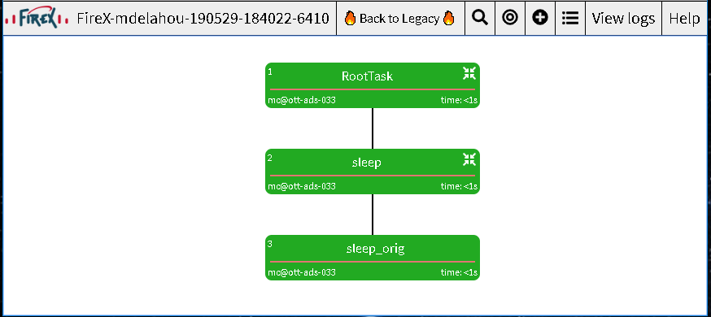

.. _quick_start:

=================
Quick Start Guide
=================

Installation
------------

Installing FireXApp is quick and straightforward. Simply use pip to install the latest packages.

.. code-block:: bash

        > pip install firexapp

To install from the latest source files:

.. code-block:: bash

    > pip install git+https://github.com/FireXStuff/firexapp.git

You can confirm that FireXApp is now installed by running basic FireXApp commands:

.. code-block:: text

    firexapp list --microservices
    firexapp info sleep

Broker
~~~~~~

FireX is built on top of Celery_, and as such, requires a broker. Currently, the only supported broker is Redis_. By
default, FireXApp will look for redis binaries in included in PATH. If you have redis install, you can verify this by
running the following command.

.. _Celery: http://www.celeryproject.org/
.. _Redis: https://redis.io/

.. code-block:: bash

    > which redis-server

If redis is installed but not in your path, it can be provided to FireXApp explicitly by setting the following
environment variable:

.. code-block:: bash

    > export redis_bin_base=<path to redis directory containing the redis binaries>

For help installing Redis, please visit the `Redis documentation <https://redis.io/documentation>`_.

Getting Tasks
-------------

Task Bundles
~~~~~~~~~~~~

The easiest way to get tasks to run using FireX App is to install a task bundle. For this example, we will install an
example foobar bundle from the git repository. But it is install just as you would any pip package.

.. code-block:: bash

    > pip install git+https://github.com/FireXStuff/firex-bundle-foobar.git

Using a plugin
~~~~~~~~~~~~~~

Alternatively, you could create your own tasks in a python module and included in FireX app using the --plugin option.
Let's begin by creating a Hello World task. Start by creating a new python file called hello.py with the following code:

.. code-block:: python

    from firexapp.engine.celery import app
    from celery.utils.log import get_task_logger

    logger = get_task_logger(__name__)

    @app.task
    def hello():
        """ A simple service that prints 'Hello, World!' to the logs """
        logger.debug('Hello, World!')

FireXApp can now access this task by including the --plugins argument

Using an environment variable
~~~~~~~~~~~~~~~~~~~~~~~~~~~~~

Finally, you can set an **'firex_tasks_directory'** environment variable to provide a directory to import tasks. After
setting the env, you can move the above defined python file into the folder and the hello task will become available
without the need to include the --plugins argument.

Basic Usage
-----------

You can call FirexApp list feature to see a list of available tasks.

.. code-block:: text

    > firexapp list --microservices

    The following microservices are available:
    firex_bundle_foobar.foo_tasks.bar
    firex_bundle_foobar.foo_tasks.foo
    firexapp.submit.report_trigger.RunInitialReport
    firexapp.tasks.core_tasks.RootTask
    firexapp.tasks.example.nop
    firexapp.tasks.example.sleep

    Use the info sub-command for more details

If you include the --plugin argument, you'll notice the new task is available

.. code-block:: text

    > firexapp list --microservices --plugins ./hello.py
    External module hello imported

    The following microservices are available:
    firex_bundle_foobar.foo_tasks.bar
    firex_bundle_foobar.foo_tasks.foo
    firexapp.submit.report_trigger.RunInitialReport
    firexapp.tasks.core_tasks.RootTask
    firexapp.tasks.example.nop
    firexapp.tasks.example.sleep
    hello.hello

    Use the info sub-command for more details

Now that we have our task available, let use learn more about it. You can use the info sub command to get details.

.. code-block:: text

    > firexapp info hello --plugins ./hello.py
    External module hello imported
    ----------------------------------------
    Short Name: hello
    Full Name: hello.hello
    ----------------------------------------
    A simple service that prints 'Hello, World!' to the logs
    ----------------------------------------

Finally, let use our task. You use the 'submit' sub command to execute the task. In this example, we'll also include
--sync so that the console is locked for the full execution of the run. This is useful for cases where firexapp needs
to block the execution, such as in a Jenkin's job. Omitting --sync will send FireX App execution to the background
instead of waiting till completion.

.. code-block:: text

    > firexapp submit --chain hello --sync --plugins ./hello.py
    [15:06:50] FireX ID: FireX-mdelahou-190528-190650-26861
    [15:06:50] Logs: /tmp/FireX-mdelahou-190528-190650-26861
    [15:06:50] export BROKER=redis://ott-ads-033:34350/0
    External module hello imported
    [15:06:53] [CeleryManager] pid 26884 became active
    [15:06:53] Waiting for chain to complete...
    [15:06:55] All tasks succeeded

We can investigate the logs to find the printed statement.

.. code-block:: text

    > cat /tmp/FireX-mdelahou-190528-190650-26861/microservice_logs/mc@ott-ads-033.html
    ...
    [2019-05-28 15:06:55,319: DEBUG/ForkPoolWorker-22] hello.hello[62e4938f-f79d-4140-9d47-629a0598d221]: Hello, World!
    ...

Assembling complex tasks
------------------------

While running one task is nice, it is hardly revolutionary. One of the great benefits of FireX App is it's ability to
easy stitch tasks together in chains or run them in parallel, all while providing clear understanding of where failures
occur.

.. code-block:: python

    import os
    from firexapp.engine.celery import app
    from celery.utils.log import get_task_logger

    logger = get_task_logger(__name__)

    @app.task(bind=True)
    def GatherResults(self, destination_dir):
        logger.debug('')
        locations = ['OTT', 'BGL', 'SJC']
        for location in locations:
            # depending on location, times may vary
            loc_task = GatherResultsFromLocation.s(location=location, destination_dir=destination_dir)
            self.enqueue_child(loc_task)

         # This will wait for all GatherResultsFromLocation, which run in parallel, to complete
         self.wait_for_children()

         # assemble a post processing chain
         final_report_dir = os.path.join(destination_dir, "final_report")
         c = AggregateResults.s(results_dir=destination_dir, destination_dir=final_report_dir)

         # chain validation behind the aggregation. The @ symbol indicates that the @returns of one task should be the
         # input to the other
         c |= ValidateResults.s(results_file='@aggregated_results_file')

         # we enqueue the chain. block=True indicates that we want to wait for it's completion before proceeding
         self.enqueue_child(c, block=True)

        logger.debug('Completed successfully')

    @app.task
    def GatherResultsFromLocation(location, destination_dir):
        logger.debug('Getting results from ' + location)
        # ...

    @app.task
    @returns('aggregated_results_file')
    def AggregateResults(results_dir, destination_dir)
        logger.debug('Aggregating all results in directory')
        # ...

    @app.task
    def ValidateResults(results_file):
        logger.debug('Looking for failures')
        # ...

In the above example, a task is schedule 3 times, targeting different data. They will run in parallel until all are
completed, before proceeding to process what the produced. The post-processing is assembled in a chain, and that chain
is scheduled and the parent task waits for it to complete.

Logs
----

For each FireX App run, a logs directory is created. All information about the run are collected there, providing a
central place to find results, traces, and the answer to that age old question: "What the hell just happened".

microservice_logs
~~~~~~~~~~~~~~~~~

This subdirectory contains all the logs that the tasks themselves log. Anytime you see `logger.debug('hello')` in a
task, that log will go into files int the microservice_logs directory. The directory consists of:

    - a main file, containing all the logs (including celery main logs). It will be named mc@host.html
    - a subdirectory, containing all the logs by individual tasks. This help you get a view of one single task.

debug
~~~~~

The debug subdirectory of the logs contains all the information pertaining to the actual FireX App engine and the
execution of the run. Some important areas of note:

    - submission.txt; This contains the debug log of the launch of the run
    - environ.json; This is a dump of the users's env at run time
    - celery/; this subdirectory contains celery's app output. This is not the log messages from the tasks themselves (see previous section), but of the celery process
    - redis/; this subdirectory contains the broker output.

Using logs_dir from inside a task
~~~~~~~~~~~~~~~~~~~~~~~~~~~~~~~~~

It is sometimes useful to store files or artifacts in the logs directory, either for debugging or for general storage.
From within a task, the path to the logs directory can be obtained using the following statement.

.. code-block:: python

    logs_dir = app.backend.get("logs_dir").decode()

Flame
-----

While the logs are filled with wonderfully detailed information about the FireX run, it can be a little overwhelming to
get a high level view of what has happened. Flame is a web interface to the FireX App run which provides a rich visual
overview of the current execution. It needs to be installed separately, but is highly recommended.

.. code-block:: text

    > pip install firex-flame

For details about Flame and it's capabilities, please refer to it's `Documentation <https://github.com/FireXStuff/firex-flame>`_

Overriding tasks
----------------

As mentioned above, plugins can be used to add new tasks available to be executed in FireX App. However, there is a
slightly more powerful affect, which is to override existing tasks already installed. This provides a means of
customizing the behaviour of existing chains and workflows without the need to overhaul the entire flow.

For example, in a python module, add the following code:

.. code-block:: python

    from firexapp.engine.celery import app
    from celery.utils.log import get_task_logger

    logger = get_task_logger(__name__)

    @app.task
    def nop():
        """ new and improved nop """
        logger.debug('New and improved nop!')
        logger.debug(__file__)

When used with the --plugin argument, this version of task will replace the existing nop that ships with FireX App. This
is highlighted when you use the list sub command.

.. code-block:: text

    > firexapp list --microservices --plugins ./my_plugin.py
    External module my_plugin imported

    The following microservices are available:
    my_plugin.nop
    firex_bundle_foobar.foo_tasks.bar
    firex_bundle_foobar.foo_tasks.foo
    firexapp.submit.report_trigger.RunInitialReport
    firexapp.tasks.core_tasks.RootTask
    firexapp.tasks.example.nop
    firexapp.tasks.example.nop_orig
    firexapp.tasks.example.sleep

    Pointers (override -> original):
    firexapp.tasks.example.nop -> my_plugin.nop

    Use the info sub-command for more details

The original microservice that was overridden can also be accessed and scheduled conveniently from the overrider. Modify
your plugin to add an override for the sleep task:

.. code-block:: python

    import time

    @app.task(bind=True)
    def sleep(self, patience=5, **kwargs):
        """ new and improved sleep """
        logger.debug('Perform pre-sleep routine')
        logger.debug('Put on PJs')
        logger.debug('Brush teeth')
        logger.debug('Read bedtime stories')
        while patience:
            logger.debug('Stall..')
            time.sleep(1)
            patience -= 1

        # now preform the original
        self.enqueue_child(self.orig.s(**kwargs), block=True)

In the above code, the new overriding task will schedule the original as a child task, obtained using **self.orig**,
performing the extra processing before hand.

The view from flame looks as follows

